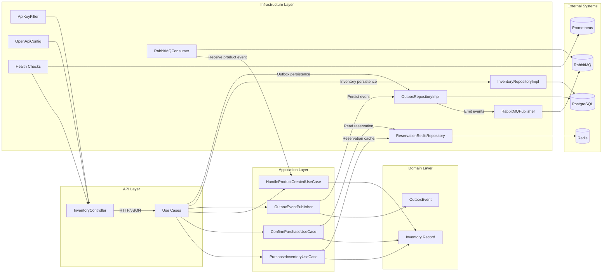

# Inventory Service Architecture and Integration Documentation

## 1. Project Overview

This project is an inventory management microservice built with Quarkus 3.20.2 and Java 17. It is designed for operational reliability and integration with external data systems, event brokers, caching, metrics, and API documentation. The architecture follows a layered clean architecture style with clear separation between domain logic, application use cases, and infrastructure adapters.

## 2. Technology Stack

- Java 17
- Quarkus 3.20.2
- Maven build system
- PostgreSQL via `quarkus-jdbc-postgresql`
- Redis via `quarkus-redis-client`
- RabbitMQ via `quarkus-messaging-rabbitmq`
- OpenAPI / Swagger via `quarkus-smallrye-openapi`
- JSON serialization with Jackson and JSON-B
- Metrics with Micrometer Prometheus via `quarkus-micrometer-registry-prometheus`
- CDI / Jakarta Dependency Injection
- JUnit 5 + Mockito for tests
- Docker multi-stage build

## 3. Architectural Style

### 3.1 Layered Clean Architecture

The service is structured into the following layers:

- `infrastructure` - Adapter implementations for persistence, messaging, cache, health, security, and web.
- `application` - Use cases and application services that orchestrate business workflows.
- `domain` - Core domain model, exceptions, business invariants, and repository contracts.
- `shared` - Utility classes such as JSON serialization helpers.

### 3.2 Key Patterns

- **Domain-Driven Design (DDD)**: `Inventory` is modeled as a domain record with business operations like `decrease()` and `addStock()`.
- **Use Case / Application Service Pattern**: Business flows are expressed through use cases such as `PurchaseInventoryUseCase`, `ConfirmPurchaseUseCase`, and `HandleProductCreatedUseCase`.
- **Ports and Adapters**: Repository interfaces define ports; `InventoryRepositoryImpl`, `OutboxRepositoryImpl`, `ReservationRedisRepository`, and `RedisReservationRepository` are adapters.
- **Outbox Pattern**: Events are persisted through `OutboxEventPublisher` before being emitted to ensure delivery resilience.
- **Event-Driven Integration**: RabbitMQ inbound/outbound channels support asynchronous product creation and inventory update events.
- **API Key Security**: `ApiKeyFilter` enforces requests with `X-API-KEY`.
- **Health and Observability**: Readiness checks for database and RabbitMQ; Prometheus metrics are enabled.

## 4. Core Integration Points

### 4.1 HTTP API

`InventoryController` exposes REST operations under `/inventory`:

- `PUT /inventory/confirmPurchase` - confirm reserved inventory
- `PUT /inventory` - update inventory values
- `PUT /inventory/doingPurchase` - reserve inventory for purchase
- `GET /inventory/{id}` - retrieve inventory by product ID
- `POST /inventory` - create/update purchase history endpoint

OpenAPI is configured by `OpenApiConfig`, and the service uses API key authentication for all requests.

### 4.2 Domain and Business Logic

- `Inventory` record contains: `id`, `idProduct`, `idUser`, `reserved`, `available`, `quantity`.
- Business invariants are enforced by domain methods such as `decrease()`.
- Use cases coordinate persistence, cache lookup, and event emission.

### 4.3 Persistence

- `InventoryRepository` is implemented by `InventoryRepositoryImpl` using `EntityManager` and JPA/Hibernate queries.
- PostgreSQL is the source of truth for persistent inventory state.
- `OutboxRepositoryImpl` persists outbox events in a relational table.

### 4.4 Cached Reservation Store

- Redis is used for temporary reservation state.
- `ReservationRedisRepository` stores reservation payloads in a Redis hash.
- The reservation TTL is 900 seconds (15 minutes).
- The service validates reservations during confirmation and removes them after purchase finalization.

### 4.5 Messaging and Event Flow

- RabbitMQ outbound channel `product-events-out` publishes inventory events.
- RabbitMQ inbound channel `product-events-in` receives product-created events.
- `RabbitMQConsumer` parses incoming events and delegates to `HandleProductCreatedUseCase`.
- `RabbitMQPublisher` sends messages via MicroProfile Reactive Messaging.

### 4.6 Metrics and Health

- Prometheus metrics are enabled at `/q/metrics`.
- Health endpoints are available through Quarkus health checks:
  - Database readiness using actual JDBC connection
  - RabbitMQ readiness via a simple readiness check

## 5. Deployment

### 5.1 Docker Build

The service uses a two-stage Docker build:

- Build stage uses `maven:3.9.9-eclipse-temurin-17`
- Runtime stage uses `eclipse-temurin:17.0.13_11-jre-alpine`
- The final image exposes port `8080`
- Healthcheck points to `http://localhost:8080/q/health/ready`

### 5.2 Runtime Configuration

Important runtime properties in `src/main/resources/application.properties`:

- `quarkus.http.host=0.0.0.0`
- `quarkus.http.port=8080`
- PostgreSQL datasource configuration with environment fallback for `QUARKUS_DATASOURCE_JDBC_URL`
- RabbitMQ connection settings for host `rabbitmq`, port `5672`, credentials `guest/guest`
- Redis node configured at `redis://redis:6379`
- Swagger UI enabled with path `/swagger`
- Prometheus export enabled at `/q/metrics`
- API key config via `inventory.api.key`

### 5.3 Recommended Deployment Topology

A production deployment model should include:

- PostgreSQL database instance or managed service
- Redis cluster or managed cache instance
- RabbitMQ broker or managed messaging service
- Container orchestration platform (Kubernetes, ECS, Docker Compose) with service discovery
- Secret management for `inventory.api.key`, database credentials, RabbitMQ credentials
- Monitoring for `/q/health/ready`, `/q/health/live`, and `/q/metrics`

## 6. Package Structure

- `com.inventory.application.command` - command objects for HTTP requests
- `com.inventory.application.usecase` - orchestrates business flows
- `com.inventory.application.service` - shared application services like outbox publishing
- `com.inventory.domain.model` - domain records and enums
- `com.inventory.domain.repository` - repository interfaces
- `com.inventory.infrastructure.persistence` - JPA repository implementations
- `com.inventory.infrastructure.redis` - Redis cache/reservation adapters
- `com.inventory.infrastructure.rabbitmq` - messaging adapters and event models
- `com.inventory.infrastructure.web` - REST controller, request/response mappers, exception handling
- `com.inventory.infrastructure.health` - health checks
- `com.inventory.infrastructure.config` - API / OpenAPI configuration
- `com.inventory.infrastructure.apikey` - API key auth filter
- `com.inventory.shared.utils` - general utilities

## 7. Primary Business Workflows

### 7.1 Reserve Purchase Workflow

1. Client calls `PUT /inventory/doingPurchase` with product and reservation details.
2. `PurchaseInventoryUseCase` loads inventory from PostgreSQL.
3. It validates available quantity and computes reserved quantity.
4. It stores reservation state in Redis through `CacheRedisRepository`.
5. It updates inventory state in PostgreSQL.
6. It persists an outbox event for inventory updated notifications.

### 7.2 Confirm Purchase Workflow

1. Client calls `PUT /inventory/confirmPurchase`.
2. `ConfirmPurchaseUseCase` retrieves reservation from Redis.
3. It verifies stock consistency and decrements inventory permanently.
4. It removes the Redis reservation entry.
5. It persists an outbox event for inventory confirmation.

### 7.3 Product Created Event Handling

1. External producer sends a RabbitMQ `PRODUCT_CREATED` event.
2. `RabbitMQConsumer` receives the event on `product-events-in`.
3. It maps the payload and delegates to `HandleProductCreatedUseCase`.
4. The use case creates a new inventory record in PostgreSQL.

## 8. Architecture Diagram

## 9. Deployment Considerations

### 9.1 Runtime Reliability

- Use environment-specific secrets for API key and datasource URL.
- Configure RabbitMQ and Redis with fault-tolerant clusters if possible.
- Enable readiness and liveness probes in the orchestration platform.
- Monitor slow queries or excessive retries in the outbox processor.

### 9.2 Performance

- Redis caching is used for short-lived purchase reservations to avoid repeated DB round-trips.
- PostgreSQL remains the authoritative state for inventory and outbox persistence.
- RabbitMQ enables loose coupling between product creation and inventory initialization.

### 9.3 Security

- API key validation is enforced by `X-API-KEY` header.
- OpenAPI documentation is generated and can be restricted by deployment configuration.
- JWT configuration is present but commented out, allowing future transition to token-based auth.

## 10. Recommendations for Evolution

- Add a dedicated outbox processor to publish pending outbox events reliably and support transactionally consistent delivery.
- Replace `System.out.println` debug statements with structured logging.
- Implement distributed tracing for cross-service workflows.
- Strengthen exception mapping for HTTP error responses.
- Introduce a dedicated `Product` domain aggregate if inventory grows beyond single-table semantics.

---

### File created
- `ARCHITECTURE.md`

This document captures current architecture, integrations, deployment strategy, and senior-level design rationale for the inventory service.
