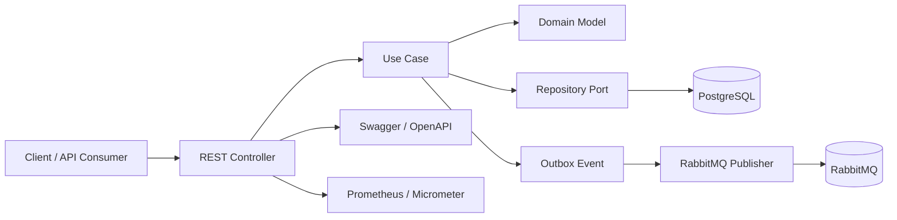

# Product Service - Technical Documentation

## 1. Overview

The Product Service is a Quarkus-based backend application designed to manage the product catalog in a modular, event-driven architecture. It exposes REST endpoints for product creation, lookup, and listing, while integrating persistence, messaging, observability, and API documentation.

The service is structured as a small domain-driven backend with clear separation between transport, application logic, domain rules, and infrastructure concerns.

## 2. Architectural Style

The project follows a layered architecture with strong influence from clean architecture and hexagonal principles:

- Presentation layer: REST controllers, request/response DTOs, validation, OpenAPI annotations
- Application layer: use cases and commands that orchestrate business operations
- Domain layer: core business entities, repository contracts, and domain events
- Infrastructure layer: PostgreSQL persistence, RabbitMQ integration, Redis support, logging, and metrics



## 3. Key Design Patterns

The implementation already reflects several solid engineering patterns:

- Repository Pattern: persistence is abstracted behind repository interfaces
- Use Case Pattern: business operations are encapsulated in dedicated classes
- Mapper Pattern: web DTOs are transformed into application/domain objects
- Outbox Pattern: domain events are stored first and later published reliably
- Dependency Injection: managed through Quarkus CDI
- Correlation ID Filter: improves traceability across requests and logs

## 4. Main Integrations

### Data and persistence
- PostgreSQL as the source of truth for products
- Hibernate ORM with Panache for persistence abstraction

### Messaging and events
- RabbitMQ for asynchronous product event publication
- Reactive messaging integration for event dispatch

### Security and API exposure
- JWT support for authentication and authorization scenarios
- OpenAPI/Swagger for API documentation and inspection

### Observability and operations
- Micrometer + Prometheus metrics
- Structured logging
- Swagger UI exposed under the service endpoint

### Platform services
- Docker Compose orchestrates PostgreSQL, RabbitMQ, Redis, Kafka, Prometheus, Grafana, Jenkins, and LocalStack

## 5. Runtime Flow

A typical create-product request follows this path:

1. A client sends a REST request to the controller.
2. The controller maps the incoming request into an application command.
3. The use case creates the domain entity and persists it.
4. An outbox event is recorded in the database.
5. A background processor publishes the event to RabbitMQ.
6. The service emits logs and metrics for observability.

This design helps decouple business execution from asynchronous delivery and improves reliability.

## 6. Deployment Model

The application is designed for container-based deployment and can run in a Dockerized environment.

### Current deployment approach
- The service is packaged as a Quarkus application
- A Dockerfile builds the service and runs the generated JAR
- Docker Compose coordinates the application and its supporting infrastructure

### Example runtime services
- Product service: port 8083
- PostgreSQL: port 5433
- RabbitMQ management UI: port 15672
- Redis: port 6379
- Prometheus: port 9090
- Grafana: port 3001

## 7. Development and Execution

### Local development
```bash
mvn quarkus:dev
```

### With Docker Compose
```bash
docker compose up -d db rabbitmq redis

docker compose up productservice
```

## 8. Quality and Testing

The project includes testing practices suited for enterprise-grade services:

- JUnit 5 for unit testing
- Mockito for isolated component testing
- Testcontainers for integration tests against PostgreSQL and RabbitMQ
- JaCoCo for coverage reporting
- Coverage gate configured for line coverage threshold

## 9. Architectural Summary

This service is a good example of a pragmatic, production-oriented backend architecture:

- modular and maintainable
- ready for event-driven extensions
- aligned with microservice-friendly deployment patterns
- observable through logs and metrics
- supports containerized deployment and orchestration

In architectural terms, the system is not a monolith in the traditional sense, but it is also not a fully distributed platform yet; it is a well-structured service that can evolve into a larger ecosystem with additional services and event consumers.
